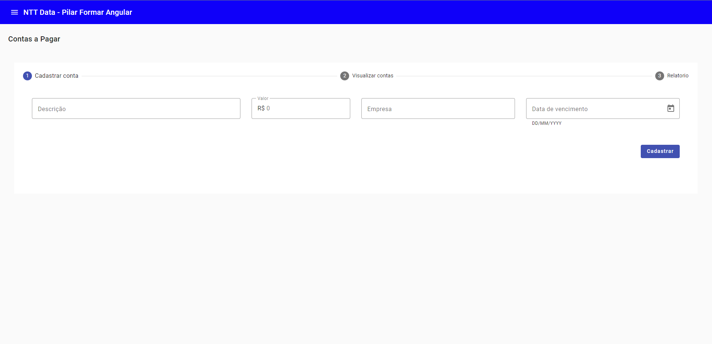
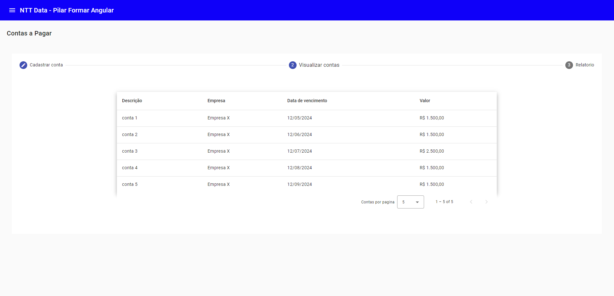

# Ntt Data  - Pilar Formar Angular

This project was generated with [Angular CLI](https://github.com/angular/angular-cli) version 17.3.0.

## Iniciando a aplicação

Execute o comando `npm run start:app` no terminal para rodar o FRONT e `npm run start:mock` para iniciar o servidor com o mock de dados.

## Explicando o projeto

Desenvolvido com o intuito de ser um projeto complementar a trilha Pilar formar - Angular. Esse projeto tem como premissa a gestão de contas a receber e pagar por uma empresa, nele você deve poder cadastrar as contas a receber e pagar, cadastrar pessoas e gerar relatórios, além de ter uma dashboard de acompanhamento.

## Desafio

Dentro de cada pasta de componente você irá encontrar um README, onde deve ser lido e feito o que se pede. Os criterios que seram avaliados são, como foi desenvolvido (layout e lógica) e o padrão de código adotado (comentario e boas praticas).

## Layout das telas

Você está livre para decidir como deve ser o layout da tela, apenas é necessário que o mesmo cumpra com os requisitos de cada desafio.
Abaixo para facilitar está um layout do mínimo esperado, onde tem os requisitos sendo cumpridos do desafio do contas a pagar.

## Links uteis

Esse projeto utiliza o [Bootstrap](https://getbootstrap.com/docs/4.0/layout/grid/) para a organização de espaçamento e utiliza o [Angular Material](https://material.angular.io/components/categories) para o layout dos componentes, acesse ambos os links para conseguir seguir com os desafios.

Sobre como salvar dados na memoria com [RXJS](https://angular.io/guide/rx-library)

Salvar os dados em memoria com [localStorage](https://warcontent.com/angular-localstorage/)